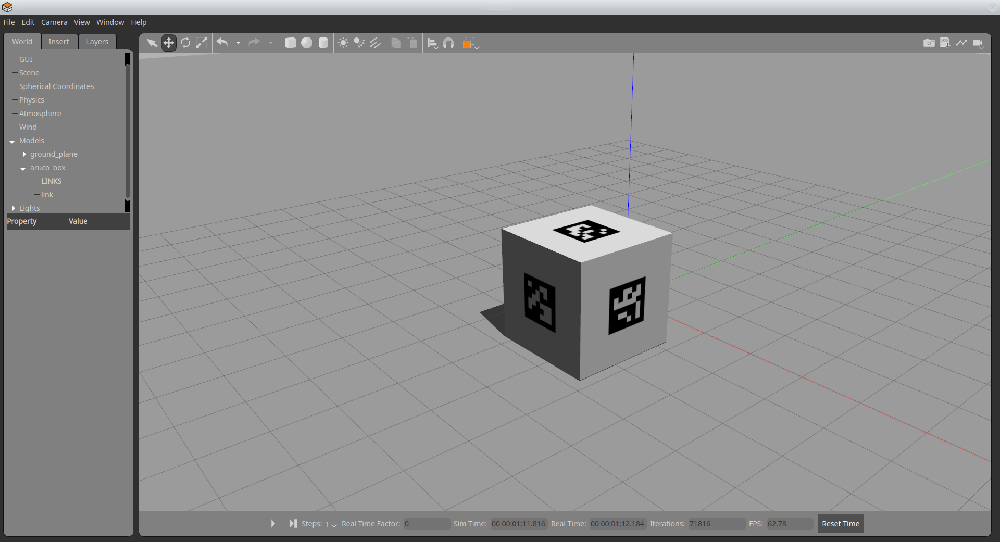

# gazebo_aruco_box

This repository provides a cube for Gazebo. An ArUco marker is attached to each side of the cube.

The current parameters are:
- marker width is 40% of the cube width
- ArUco marker IDs are 0,1,..,5
- Cube size is 1x1x1m

## Installation

Download the repository and add this directory to the **GAZEBO_MODEL_PATH** environment variable. 

## Usage

Open Gazebo and navigate to the "Insert" tab. There, you will find the "Box with ArUco markers" model. 

## Customization

You can create the texture for the cube yourself. See the script "src/create_marker_tile_image.py" for more details. 
The Blender model is also added to the repo (aruco_box/aruco_marker.blend). 

## ToDo / new features
- [ ] add a gazebo world file
   - [ ] add camera sensor
- [ ] integrate ArUco marker detection, e.g. https://wiki.ros.org/aruco_detect
